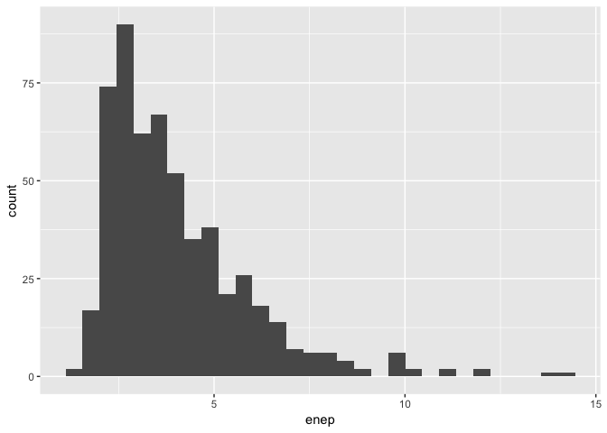

Histogram Challenge
================

## The Challenge

Clark and Golder (2006) claim:

> Social heterogeneity increases the number of parties, but only when
> electoral institutions are sufficiently permissive.

Evaluate this claim using **using only histograms**.

## The Hypothesis

[Clark and Golder (2006)](http://mattgolder.com/files/research/cps2.pdf)
write the following:

> These strategic considerations indicate that electoral institutions
> modify the relationship between socioeconomic cleavages and the number
> of parties. In particular, this framework indicates that there are two
> reasons why a country might have a small number of parties. First, it
> could be the case that the demand for parties is low because there are
> few social cleavages. In this situation, there would be few parties
> whether the electoral institutions were permissive or not. Second, it
> could be the case that the electoral system is not permissive. In this
> situation, there would be a small number of parties even if the demand
> for political parties were high. Only a polity characterized by both a
> high degree of social heterogeneity and a highly permissive electoral
> system is expected to produce a large number of parties. This line of
> reasoning generates the following hypothesis: **Social heterogeneity
> increases the number of parties, but only when electoral institutions
> are sufficiently permissive.**

## The Data

I have the following data (from the authors) to evaluate this claim:

``` r
# load packages
library(tidyverse)

# load data
cg_df <- read_rds("data/parties.rds") %>%
  glimpse()
```

    ## Observations: 555
    ## Variables: 10
    ## $ country              <chr> "Albania", "Albania", "Albania", "Argenti...
    ## $ year                 <int> 1992, 1996, 1997, 1946, 1951, 1954, 1958,...
    ## $ average_magnitude    <dbl> 1.00, 1.00, 1.00, 10.53, 10.53, 4.56, 8.1...
    ## $ eneg                 <dbl> 1.10693, 1.10693, 1.10693, 1.34210, 1.342...
    ## $ enep                 <dbl> 2.190, 2.785, 2.870, 5.750, 1.970, 1.930,...
    ## $ upper_tier           <dbl> 28.57, 17.86, 25.80, 0.00, 0.00, 0.00, 0....
    ## $ en_pres              <dbl> 0.00, 0.00, 0.00, 2.09, 1.96, 1.96, 2.65,...
    ## $ proximity            <dbl> 0.00, 0.00, 0.00, 1.00, 1.00, 0.20, 1.00,...
    ## $ social_heterogeneity <fct> Bottom 3rd of ENEG, Bottom 3rd of ENEG, B...
    ## $ electoral_system     <fct> Single-Member District, Single-Member Dis...

``` r
# create histogram
ggplot(cg_df, aes(x = enep)) + 
  geom_histogram()
```

<!-- -->

There is a comma-separated version as well. I made a
[codebook](https://pos5737.github.io/data/parties-codebook.html) as
well.

## The Histograms

Create histograms (or variants, such as density plots) to evaluate Clark
and Golder’s argument. Be creative, but try to **cleary show their key
claim**: *Social heterogeneity increases the number of parties, but only
when electoral institutions are sufficiently permissive.*

Feel free to use whatever software you like and manipulate the data in
any way that’s helpful.
